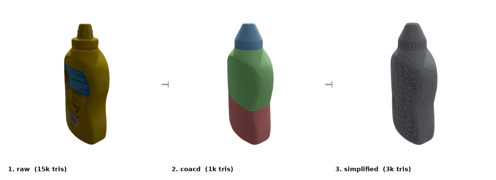
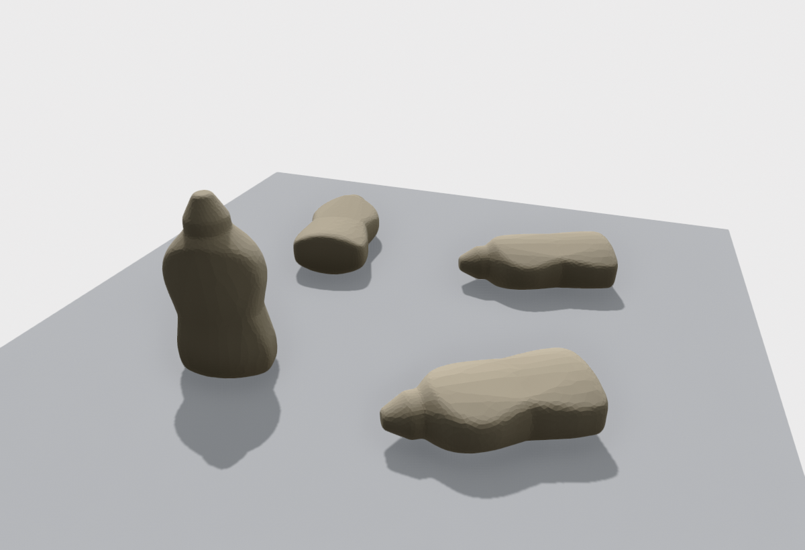
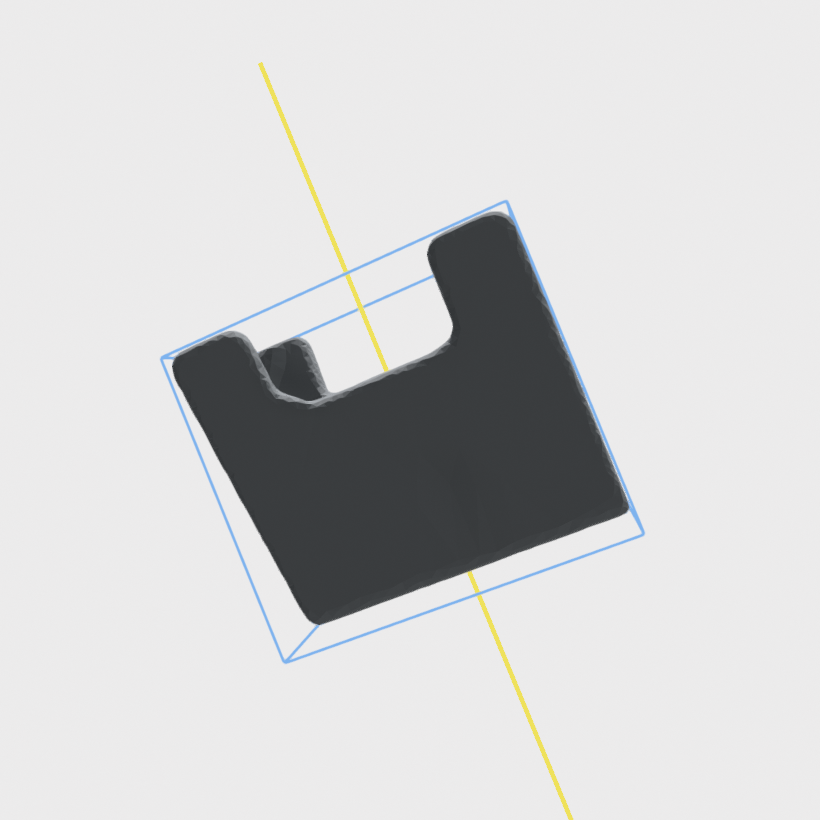

# `visualization/` — headless rendering & web export

Turns processed objects into pictures and web assets. Open3D is an optional,
heavy dependency, imported lazily — importing this package never requires it.
Install it with `pip install -e .[render]`.

## [`render.py`](render.py) — figures & GIFs (Open3D offscreen)

No display needed (EGL/GPU offscreen). Run as `python -m object_processing.visualization.render <cmd>`:

| Command | What it makes |
|---------|---------------|
| `pipeline <obj> --out fig.png` | labeled `raw → coacd → simplified` strip (coacd colored per convex piece) |
| `tabletop <obj> --out fig.png` | the mesh resting in each stable tabletop pose, on a ground plane |
| `overlays <obj> --out fig.png` | mesh + oriented bounding box + symmetry axes |
| `turntable <obj> --out spin.gif` | a spinning GIF of a stage mesh |

Pipeline stages:

Tabletop poses &nbsp;·&nbsp; OBB + symmetry overlays:

## [`webexport.py`](webexport.py) — assets for the web viewer

Run as `python -m object_processing.visualization.webexport --all`:

- **stage GLBs** → `wiki/output/objects/{id}/stages/{raw,coacd,simplified}.glb`
  (coacd colored per piece) — uploaded to HuggingFace next to `mesh.glb`.
- **`info.json`** → `docs/objects/{id}/info.json` — small overlay data (OBB,
  symmetry, tabletop poses) in the object frame, committed and served by Pages.

The web viewer ([`docs/viewer.html`](../../docs/viewer.html)) toggles between the
stage GLBs and draws the `info.json` overlays. Meshes and overlays share one
coordinate frame, so the viewer draws overlays with no frame conversion.
