# Object Processing

Mesh and object data-preparation pipeline for the AutoDex project, with a
web-based 3D browser for the results.

Give it a raw textured `.obj` and it produces everything downstream needs:
a convex collision decomposition, watertight and simplified meshes, URDF/MJCF,
bounding box and mass properties, rotational symmetry, and stable tabletop poses.

**Gallery:** https://willi19.github.io/object_processing/

## IKEA source objects

38 of the scanned objects are off-the-shelf IKEA products. Each row links
to the 3D model in the gallery and to the IKEA product page. Prices are list
price in KRW (₩) at scan time and may have changed.

<details>
<summary>Shopping list — 38 objects</summary>

| | Object | IKEA | Description | Price (₩) | Link |
|---|--------|------|-------------|----------:|------|
| 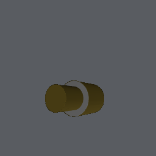 | [Green Lamp](https://willi19.github.io/object_processing/viewer.html?id=green_lamp) | SPETSBOJ | Table lamp, dimmable green | 24,900 | [SPETSBOJ ↗](https://www.ikea.com/kr/en/p/spetsboj-table-lamp-dimmable-green-00591620/) |
| 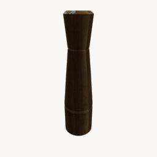 | [Spicemill](https://willi19.github.io/object_processing/viewer.html?id=spicemill) | INTRESSANT | Spice mill, acacia | 19,900 | [INTRESSANT ↗](https://www.ikea.com/kr/en/p/intressant-spice-mill-acacia-30301898/) |
| 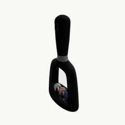 | [Knife Sharpner](https://willi19.github.io/object_processing/viewer.html?id=knife_sharpner) | SKÄRANDE | Knife sharpener, black | 14,900 | [SKÄRANDE ↗](https://www.ikea.com/kr/en/p/skaerande-knife-sharpener-black-30289170/) |
| 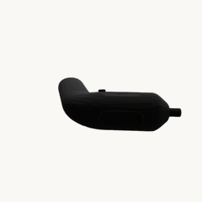 | [Screwdriver](https://willi19.github.io/object_processing/viewer.html?id=screwdriver) | TRIXIG | Screwdriver, li-ion | 14,900 | [TRIXIG ↗](https://www.ikea.com/kr/en/p/trixig-screwdriver-li-ion-60566967/) |
| 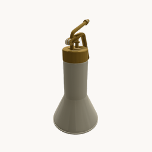 | [Plant Mister](https://willi19.github.io/object_processing/viewer.html?id=plant_mister) | VATTENKRASSE | Plant mister, ivory/gold colour | 12,900 | [VATTENKRASSE ↗](https://www.ikea.com/kr/en/p/vattenkrasse-plant-mister-ivory-gold-colour-10561991/) |
| 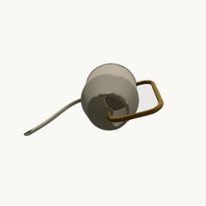 | [Wateringcan](https://willi19.github.io/object_processing/viewer.html?id=wateringcan) | VATTENKRASSE | Watering can, ivory/gold colour | 10,900 | [VATTENKRASSE ↗](https://www.ikea.com/kr/en/p/vattenkrasse-watering-can-ivory-gold-colour-90394154/) |
| 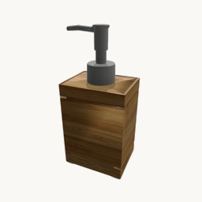 | [Soap Dispenser](https://willi19.github.io/object_processing/viewer.html?id=soap_dispenser) | DRAGAN | Soap dispenser, bamboo | 9,900 | [DRAGAN ↗](https://www.ikea.com/kr/en/p/dragan-soap-dispenser-bamboo-70271494/) |
| 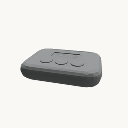 | [Meat Thermometer](https://willi19.github.io/object_processing/viewer.html?id=meat_thermometer) | FANTAST | Meat thermometer/timer, digital black | 9,900 | [FANTAST ↗](https://www.ikea.com/kr/en/p/fantast-meat-thermometer-timer-digital-black-10171303/) |
| 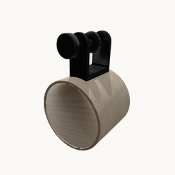 | [Mug Holder](https://willi19.github.io/object_processing/viewer.html?id=mug_holder) | LÅNESPELARE | Mug holder, ash veneer | 9,900 | [LÅNESPELARE ↗](https://www.ikea.com/kr/en/p/lanespelare-mug-holder-ash-veneer-10571527/) |
| 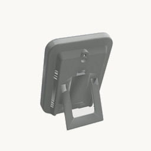 | [Thermo Clock](https://willi19.github.io/object_processing/viewer.html?id=thermo_clock) | SLÅTTIS | Clock with hygro-/thermometer, white | 9,900 | [SLÅTTIS ↗](https://www.ikea.com/kr/en/p/slattis-clock-with-hygro-thermometer-white-90578092/) |
| 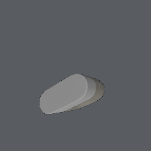 | [Donut Light](https://willi19.github.io/object_processing/viewer.html?id=donut_light) | SOLVINDEN | Table lamp, battery-operated donut-shaped | 9,900 | [SOLVINDEN ↗](https://www.ikea.com/us/en/p/solvinden-table-lamp-battery-operated-donut-shaped-70594007/) |
| 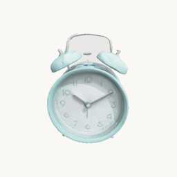 | [Clock](https://willi19.github.io/object_processing/viewer.html?id=clock) | PLIRA | Alarm clock, turquoise | 8,500 | [PLIRA ↗](https://www.ikea.com/kr/en/p/plira-alarm-clock-turquoise-60540840/) |
| 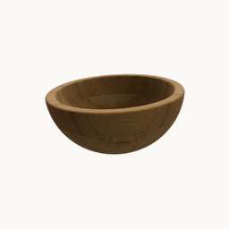 | [Servingbowl Small](https://willi19.github.io/object_processing/viewer.html?id=servingbowl_small) | BLANDA MATT | Serving bowl, bamboo | 7,900 | [BLANDA MATT ↗](https://www.ikea.com/kr/en/p/blanda-matt-serving-bowl-bamboo-80222974/) |
| 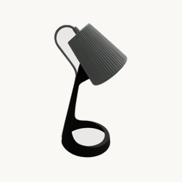 | [Work Lamp](https://willi19.github.io/object_processing/viewer.html?id=work_lamp) | SVALLET | Work lamp, dark grey/white | 7,500 | [SVALLET ↗](https://www.ikea.com/kr/en/p/svallet-work-lamp-dark-grey-white-00358495/) |
| 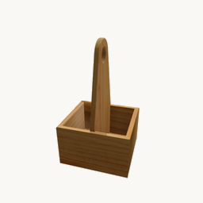 | [Wood Organizer](https://willi19.github.io/object_processing/viewer.html?id=wood_organizer) | CHOKLADHAJ | Portable organiser, wood | 6,900 | [CHOKLADHAJ ↗](https://www.ikea.com/us/en/p/chokladhaj-portable-organizer-wood-10584351/) |
| 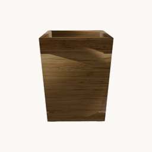 | [Bamboo Box](https://willi19.github.io/object_processing/viewer.html?id=bamboo_box) | DRAGAN | Toothbrush holder, bamboo | 6,900 | [DRAGAN ↗](https://www.ikea.com/kr/en/p/dragan-toothbrush-holder-bamboo-10271492/) |
| 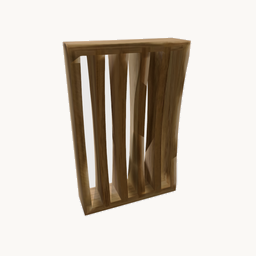 | [Soaptray](https://willi19.github.io/object_processing/viewer.html?id=soaptray) | DRAGAN | Soap dish, bamboo | 5,900 | [DRAGAN ↗](https://www.ikea.com/kr/en/p/dragan-soap-dish-bamboo-50271490/) |
| 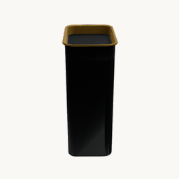 | [Coffee Tin](https://willi19.github.io/object_processing/viewer.html?id=coffee_tin) | BLOMNING | Coffee/tea tin | 4,900 | [BLOMNING ↗](https://www.ikea.com/kr/en/p/blomning-coffee-tea-tin-40373205/) |
| 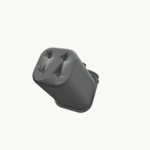 | [Toothbrush Holder](https://willi19.github.io/object_processing/viewer.html?id=toothbrush_holder) | TISKEN | Toothbrush holder with suction cup, white | 4,900 | [TISKEN ↗](https://www.ikea.com/kr/en/p/tisken-toothbrush-holder-with-suction-cup-white-50381295/) |
| 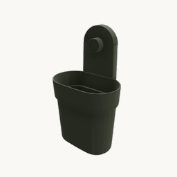 | [Attached Container](https://willi19.github.io/object_processing/viewer.html?id=attached_container) | ÖBONÄS | Container with suction cup, grey-green | 4,900 | [ÖBONÄS ↗](https://www.ikea.com/kr/en/p/oebonaes-container-with-suction-cup-grey-green-40515587/) |
| 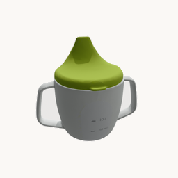 | [Baby Beaker](https://willi19.github.io/object_processing/viewer.html?id=baby_beaker) | BÖRJA | Training beaker | 3,900 | [BÖRJA ↗](https://www.ikea.com/kr/en/p/boerja-training-beaker-00213884/) |
| 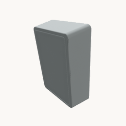 | [White Plastic Box](https://willi19.github.io/object_processing/viewer.html?id=white_plastic_box) | KUGGIS | Box, white | 3,900 | [KUGGIS ↗](https://www.ikea.com/kr/en/p/kuggis-box-white-10568563/) |
| 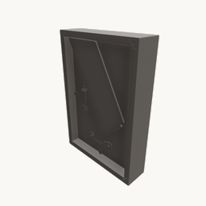 | [Frame Oak](https://willi19.github.io/object_processing/viewer.html?id=frame_oak) | RÖDALM | Frame, oak effect | 3,900 | [RÖDALM ↗](https://www.ikea.com/kr/en/p/roedalm-frame-oak-effect-30566389/) |
| 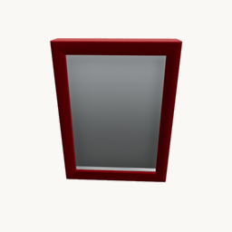 | [Frame Red](https://willi19.github.io/object_processing/viewer.html?id=frame_red) | RÖDALM | Frame, red | 3,900 | [RÖDALM ↗](https://www.ikea.com/kr/en/p/roedalm-frame-red-60566359/) |
| 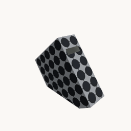 | [Magazine File](https://willi19.github.io/object_processing/viewer.html?id=magazine_file) | TJENA | Magazine file, anthracite | 3,900 | [TJENA ↗](https://www.ikea.com/kr/en/p/fjaederharv-magazine-file-anthracite-20596914/) |
| 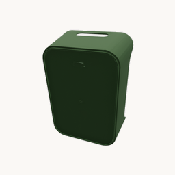 | [Open Box](https://willi19.github.io/object_processing/viewer.html?id=open_box) | UPPDATERA | Box, green | 2,900 | [UPPDATERA ↗](https://www.ikea.com/kr/en/p/uppdatera-box-green-50504055/) |
| 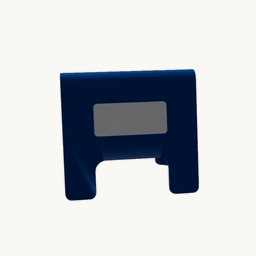 | [Blue Alarm](https://willi19.github.io/object_processing/viewer.html?id=blue_alarm) | KUPONG | Alarm clock, bright blue | 2,000 | [KUPONG ↗](https://www.ikea.com/us/en/p/kupong-alarm-clock-bright-blue-90592125/) |
| 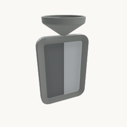 | [Standing Frame](https://willi19.github.io/object_processing/viewer.html?id=standing_frame) | FIKONTRÄD | Frame, white | 1,900 | [FIKONTRÄD ↗](https://www.ikea.com/kr/en/p/fikontraed-frame-white-80556316/) |
| 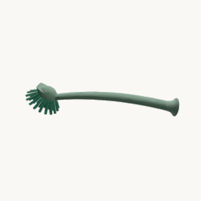 | [Washing Brush](https://willi19.github.io/object_processing/viewer.html?id=washing_brush) | RINNIG | Dish-washing brush, green | 1,900 | [RINNIG ↗](https://www.ikea.com/kr/en/p/rinnig-dish-washing-brush-green-20407819/) |
| 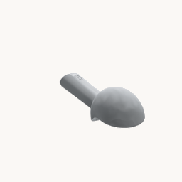 | [Icecream Scoop](https://willi19.github.io/object_processing/viewer.html?id=icecream_scoop) | UPPFYLLD | Ice-cream scoop, turquoise | 1,900 | [UPPFYLLD ↗](https://www.ikea.com/kr/en/p/uppfylld-ice-cream-scoop-turquoise-70533226/) |
| 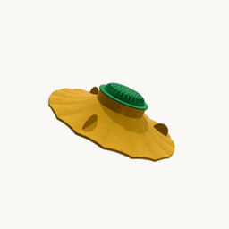 | [Lemon Squeezer](https://willi19.github.io/object_processing/viewer.html?id=lemon_squeezer) | UPPFYLLD | Lemon squeezer, bright yellow/bright green | 1,900 | [UPPFYLLD ↗](https://www.ikea.com/kr/en/p/uppfylld-lemon-squeezer-bright-yellow-bright-green-70528692/) |
| 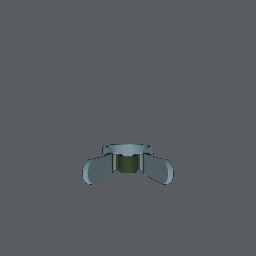 | [Large Peg](https://willi19.github.io/object_processing/viewer.html?id=large_peg) | SLIBB | Large peg, blue/green | 1,500 | [SLIBB ↗](https://www.ikea.com/kr/en/p/slibb-large-peg-blue-green-10567771/) |
| 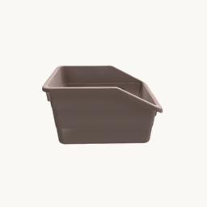 | [Box Pink](https://willi19.github.io/object_processing/viewer.html?id=box_pink) | SOCKERBIT | Box, pink | 1,500 | [SOCKERBIT ↗](https://www.ikea.com/kr/en/p/sockerbit-box-pink-70444678/) |
| 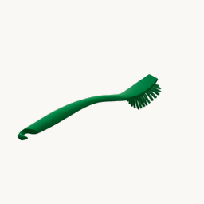 | [Washing Brush2](https://willi19.github.io/object_processing/viewer.html?id=washing_brush2) | ANTAGEN | Dish-washing brush, bright green | 1,000 | [ANTAGEN ↗](https://www.ikea.com/kr/en/p/antagen-dish-washing-brush-bright-green-40534227/) |
| 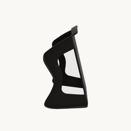 | [Shoe Organizer](https://willi19.github.io/object_processing/viewer.html?id=shoe_organizer) | MURVEL | Shoe organiser, grey | 1,000 | [MURVEL ↗](https://www.ikea.com/kr/en/p/murvel-shoe-organiser-grey-20469421/) |
| 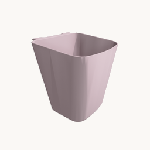 | [Container Pink](https://willi19.github.io/object_processing/viewer.html?id=container_pink) | SUNNERSTA | Container, light pink | 1,000 | [SUNNERSTA ↗](https://www.ikea.com/kr/en/p/sunnersta-container-light-pink-40556182/) |
| 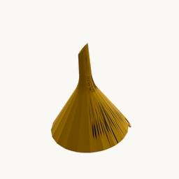 | [Yellow Funnel](https://willi19.github.io/object_processing/viewer.html?id=yellow_funnel) | UPPFYLLD | Funnel, bright yellow | 1,000 | [UPPFYLLD ↗](https://www.ikea.com/kr/en/p/uppfylld-funnel-bright-yellow-60521931/) |
| 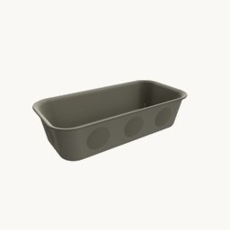 | [Organizer Beige](https://willi19.github.io/object_processing/viewer.html?id=organizer_beige) | NOJIG | Organiser, plastic beige | 800 | [NOJIG ↗](https://www.ikea.com/kr/en/p/nojig-organiser-plastic-beige-70468080/) |

</details>

## Pipeline

A raw mesh is decomposed, simplified, and measured. Every stage takes explicit
input/output paths and raises on failure — nothing is silently swallowed.


| # | Stage | Tool | Produces |
|---|-------|------|----------|
| 1 | `change_format` | trimesh | `mesh/raw.obj` |
| 2 | `convex_decompose` | CoACD | `mesh/coacd.obj`, `urdf/meshes/*.obj` |
| 3 | `export_urdf` / `export_mjcf` | lxml | `urdf/coacd.urdf`, `urdf/coacd.xml` |
| 4 | `manifold` | CoACD | `mesh/manifold.obj` (watertight) |
| 5 | `simplify` | ACVD | `mesh/simplified.obj` (~2k verts) |
| 6 | `basic_info` | trimesh | `info/simplified.json` (OBB, mass, center) |
| 7 | `compute_symmetry` | trimesh + scipy | `info/symmetry.json` |
| 8 | `generate_tabletop_poses` | MuJoCo | `info/tabletop/*.npy` |

Inputs live at `{OBJECT_ROOT}/{obj}/raw_mesh/`; outputs land under
`{OBJECT_ROOT}/{obj}/processed_data/`.

## Code layout

`object_processing/` is the importable **library** (the processing code); `src/`
holds the **runnable scripts** that drive it.

| Path | Role | Docs |
|------|------|------|
| [`object_processing/pipeline/`](object_processing/pipeline/) | mesh processing stage functions (decompose → simplify → measure → symmetry → tabletop) | [README](object_processing/pipeline/README.md) |
| [`object_processing/visualization/`](object_processing/visualization/) | headless figure / turntable / web-export functions | [README](object_processing/visualization/README.md) |
| [`object_processing/utils/`](object_processing/utils/) | data-root config, external-tool resolution, rotation math | [README](object_processing/utils/README.md) |
| [`object_processing/runner.py`](object_processing/runner.py) | batch orchestration the run scripts share (per-object actions + parallel runner) | — |
| `src/{process,decimate,symmetry,tabletop}.py` + [`src/run.sh`](src/run.sh) | per-command run scripts (thin; logic lives in the library) | — |
| [`src/render.py`](src/render.py), [`src/webexport.py`](src/webexport.py) | figure + web-export CLIs | — |
| [`src/viewers/`](src/viewers/) | interactive desktop viewers (Viser) | [README](src/viewers/README.md) |

## How to

### Install

```bash
# Create and activate the environment (Python 3.10)
conda create -n object_processing python=3.10 -y
conda activate object_processing

# Install dependencies, then the package itself
pip install -r requirements.txt
pip install -e .            # core pipeline (editable, so AutoDex can import it)

pip install -e .[render]    # optional: + headless Open3D figures/GIFs
pip install -e .[viewers]   # optional: + the Viser desktop viewers (also needs `paradex`)
```

CoACD and ACVD are native binaries, resolved from `$COACD_BIN` / `$ACVD_BIN`,
otherwise `third_party/` at the repo root (not vendored — provisioned separately).

### Where the data lives

Every command resolves the per-object root from the `OBJECT_ROOT` environment
variable (default `~/shared_data/AutoDex/object/paradex`). Point it at your own
copy so a dataset shared with other tools is never written to:

```bash
export OBJECT_ROOT=~/object_data/paradex
```

### Run the pipeline

Each stage is its own script (run directly, or via `src/run.sh <cmd>`):

```bash
python src/process.py <obj> [<obj> ...]
python src/process.py --all --workers 8     # everything, parallel
python src/process.py --all --skip          # skip stages already done

python src/symmetry.py --all                 # (re)detect symmetry only
python src/tabletop.py --all                  # (re)generate stable poses (+settling motion)
python src/decimate.py --all                  # lightweight meshes for viewing

./src/run.sh process --all --skip             # same thing via the dispatcher
```

### Download meshes (no dependencies)

```bash
cd wiki/
python download_meshes.py --list                 # list all available objects
python download_meshes.py --all                   # all OBJ meshes (+ MTL + textures)
python download_meshes.py apple banana baseball   # specific objects
python download_meshes.py --all --format glb      # GLB instead of OBJ
```

Files are saved to `downloaded_meshes/{name}/` (override with `--output`).

### Visualize

Three ways to inspect the processed data, by increasing setup.

**1. Interactive desktop viewers** — `src/viewers/` (Viser). Needs
`pip install -e ".[viewers]"` **and** the `paradex` package on `PYTHONPATH`. Each
opens a Viser server in your browser; the object root comes from `$OBJECT_ROOT`.

```bash
python src/viewers/object_viewer.py      # raw / coacd / simplified side by side + OBB
python src/viewers/table_top.py          # grid of all stable tabletop poses + OBB/axes
python src/viewers/tabletop_compare.py   # compare pose pairs (gravity-axis/yaw factored out)
python src/viewers/cylinder_axis.py      # rotate about a candidate axis, measure symmetry residual
```

**2. Headless figures / GIFs** — `src/render.py` (Open3D offscreen, no display).
Needs `pip install -e ".[render]"`.

```bash
python src/render.py pipeline  <obj> --out fig.png       # raw → coacd → manifold → simplified strip
python src/render.py tabletop  <obj> --out poses.png     # mesh in each stable pose on a ground plane
python src/render.py overlays  <obj> --out obb_sym.png   # mesh + OBB + symmetry axes
python src/render.py turntable <obj> --out spin.gif [--stage simplified]
```

| Tabletop poses | OBB + symmetry overlay |
|---|---|
|  |  |

**3. Web gallery** — `src/webexport.py` bundles per-object assets for the static
site: stage GLBs (uploaded to HuggingFace) and small `info.json` overlays (OBB +
symmetry + tabletop poses, committed to `docs/`).

```bash
python src/webexport.py <obj> --all      # stage GLBs + info.json
```

Then serve `docs/` (see [Deploy the gallery website](#deploy-the-gallery-website)).
Live gallery: https://willi19.github.io/object_processing/

### Deploy the gallery website

The gallery is served from `docs/` on `main`. To add or refresh objects:

```bash
cd wiki/
python convert_objects.py <input_dir> output      # OBJ -> GLB + catalog.json
python generate_thumbnails.py <input_dir> output   # 256x256 thumbnails
python upload_to_hf.py output                       # GLBs -> HuggingFace
python upload_obj_to_hf.py <input_dir>              # original OBJs -> HuggingFace

# copy the static site + new thumbnails into docs/, then commit & push
cp wiki/index.html wiki/viewer.html wiki/catalog.json docs/
cp wiki/js/viewer.js docs/js/
for dir in wiki/output/objects/*/; do
  name=$(basename "$dir")
  mkdir -p "docs/objects/$name"
  [ -f "$dir/thumb.png" ] && cp "$dir/thumb.png" "docs/objects/$name/thumb.png"
done
git add docs/ && git commit -m "Update gallery" && git push
```

GitHub Pages auto-deploys from `docs/` on `main`.
